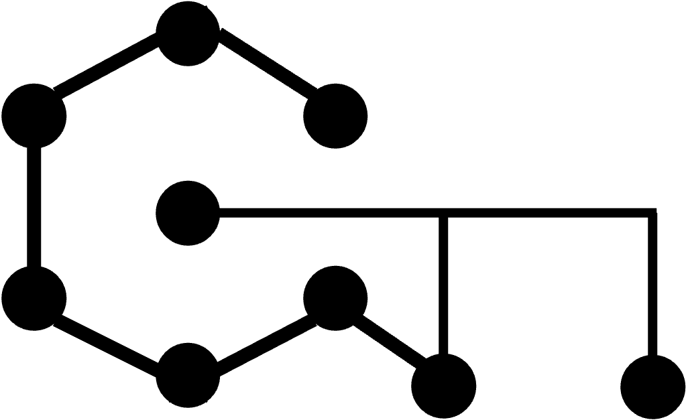

# Source code for the paper entitled "Universal compilation for quantum state tomography"



Author: Vu Tuan Hai (haivt@uit.edu.vn) and Le Bin Ho (binho@fris.tohoku.ac.jp)

Access: https://doi.org/10.1038/s41598-023-30983-4

Bibitem:

```
@Article{Hai2023,
      author={Hai, Vu Tuan and Ho, Le Bin},
      title={Universal compilation for quantum state tomography},
      journal={Scientific Reports},
      year={2023},
      month={Mar},
      day={06},
      volume={13},
      number={1},
      pages={3750},
      issn={2045-2322},
      doi={10.1038/s41598-023-30983-4},
      url={https://doi.org/10.1038/s41598-023-30983-4}
}
```

How to use this code:

- Folder experiments: contains all data
- Folder codes: python script and jupyter notebook file, you can find many Figures in these file, or reuse some codes from base module.
- Folder docs: hand-written for discussions between authors.
